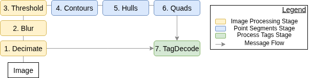

# ApriltagCPP Application (Software)

* this algorithm is based on the [Swatbotics Lab Version](https://github.com/swatbotics/apriltags-cpp) relying heavily on OpenCV and GCAL instead of the original Apriltag MIT/3 version which relies on custom C functions
* the phases of the algorithm are described in the figure

