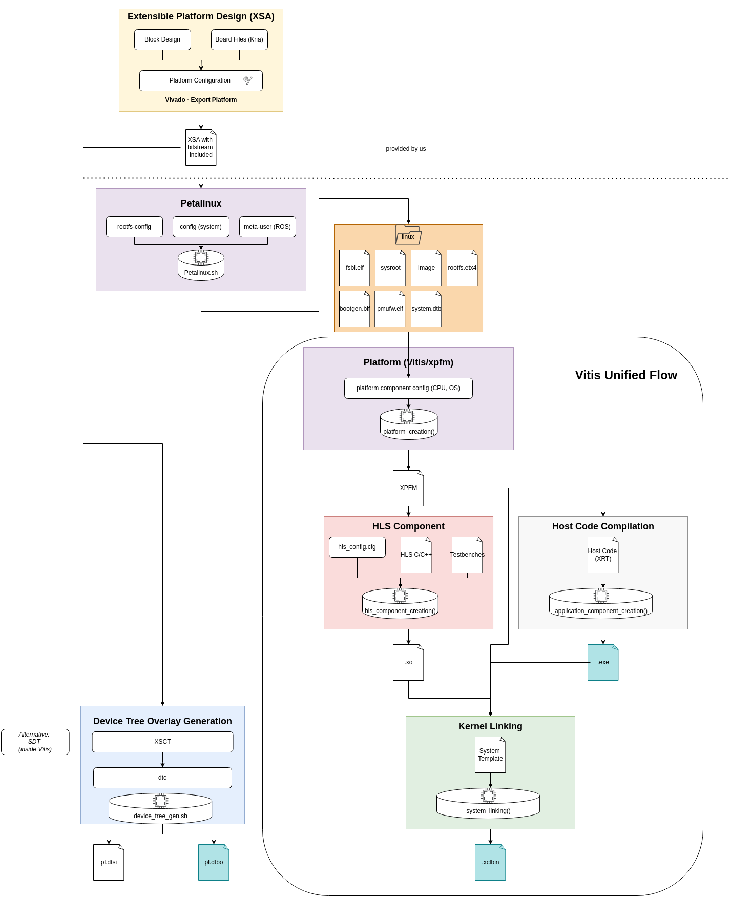
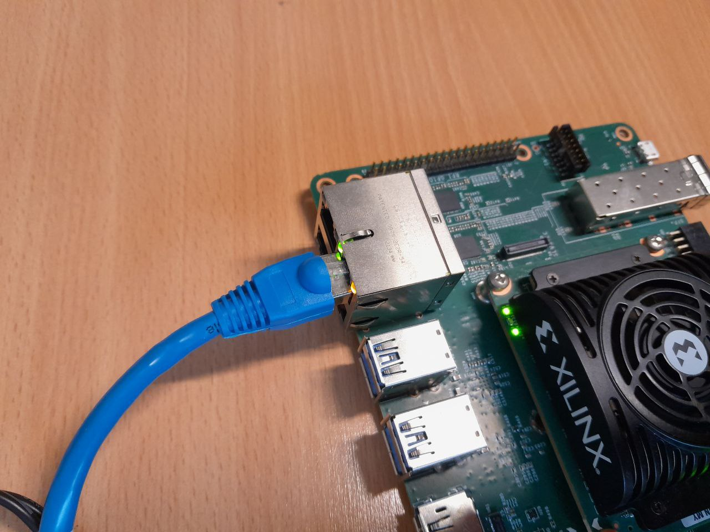

# Petalinux OS Generation

* Version 2024.1

## Overview

This repository includes Python/Bash scripts for a Petalinux-based firmware to be flashed on an SD-card or used for further steps.
It already integrates a working ROS2 installation.

## Prerequisites

### Petalinux
* download PetaLinux 2024.1 installer + `Kria KR260 Starter Kit BSP` (you need the one respectively for your board, but Petalinux requires a BSP file)
  * currently under [PetaLinux](https://www.xilinx.com/support/download/index.html/content/xilinx/en/downloadNav/embedded-design-tools.html)
* before installing, run 
  * `sudo apt-get install iproute2 gawk build-essential gcc git make net-tools libncurses5-dev tftpd zlib1g-dev libssl-dev flex bison libselinux1 gnupg wget diffstat chrpath socat xterm autoconf libtool tar unzip texinfo zlib1g-dev gcc-multilib automake zlib1g:i386 screen pax gzip cpio python3-pip python3-pexpect xz-utils debianutils iputils-ping python3-git python3-jinja2 libegl1-mesa libsdl1.2-dev`
  * `pip install pylint`
* then continue with installing petalinux
  * `chmod +x` to the script `petalinux-xxx-installer.run`
  * `./petalinux-xxx-installer.run`
  * recommend installation location is under `/opt/xilinx/petalinux`

*Note: Because the BSP can be quite big, they are not included by default but you need to download them manually after cloning and update the location in the `scripts/petalinux.sh` - default location is under `artifacts/`*

*Note: Adjust the paths to your personal machine respectively*

## Build Petalinux OS
* launch a new terminal and switch to bash (if you use zsh/fsh,.. simply run `bash`)
* run `source /opt/xilinx/petalinux/settings.sh` 
* run `scripts/petalinux.sh`

### Pre-Steps to run HLS Application on Petalinux
* install SDK locally
  * `source /opt/xilinx/petalinux/settings.sh`
  * navigate to `build_petalinux/images/linux`
  * run `./sdk.sh -d ../../../..` (might need to create folders beforehand)
  * compile applications for petalinux via `. <project-path>/build/platform/sysroot/environment-setup-cortexa72-cortexa53-xilinx-linux`
* generate manually device tree overlay
  * 2 options: XSCT vs SDT, we use XSCT for now

### XSCT
* source Vitis 2024
* run `../scripts/device_tree_gen.sh`

## Usage Guide (on the Board)

* general flow depicted in 
* Vitis Unified Flow is the Vitis Workspace (we dont care about that here for now)

### Petalinux
* use default configuration when ever possible
* `openssh` > `dropbear` (due to networking speed)
  * openssh will always be enabled by default via kria acceleration package -> causes failures when trying to use dropbear
* login via `petalinux` `pw`
  * `su - petalinux` first login will let you chose your pw
* first thing to do is establish ssh connection
  * `sudo ifconfig eth0 192.168.2.4` for petalinux (chose whatever you prefer)
  * `ssh petalinux@192.168.2.4`
* connect cable into upper left port (see image)

## Frequent Issues

### SSH is not working
* plenty of possibilities:
  * first check that dropbear is disabled and openssh enabled in `rootfs_config` [Ticket](https://adaptivesupport.amd.com/s/question/0D52E00006sl3paSAA/petalinux-cannot-use-openssh-instead-of-dropbear?language=en_US)
    * `CONFIG_imagefeature-ssh-server-dropbear is not set`
    * `CONFIG_imagefeature-ssh-server-openssh=y`
    * `packagegroup-core-ssh-dropbear is not set` 
  * check the wired connection is in the right port and connected to the PC
    * top and bottom right both might work - depends on your `xsa` design, I currently use lower right (right if you look at ports from the front)
  * check status of sshd via `sudo systemctl status sshd`
  * set ip of `eth0` network on both sides
    * PC is needs to be configured manually to `192.168.2.1` (look for USB connection if you use an adapter)
    * configure board to something else, default for petalinux is `192.168.2.4`, for ubuntu `192.168.2.2`
  * 

### Manual Debugging when something strange fails
* manually copy from Ubuntu sysroot: 
* `foonathan-memory`
* `opencv4`
* `python3-numpy`
* `petalinux/build/tmp/sysroots-components/aarch64/`
see also https://adaptivesupport.amd.com/s/question/0D52E00006mEc4wSAC/building-smartcam-app-error-missing-libcorrespondencea-?language=en_US