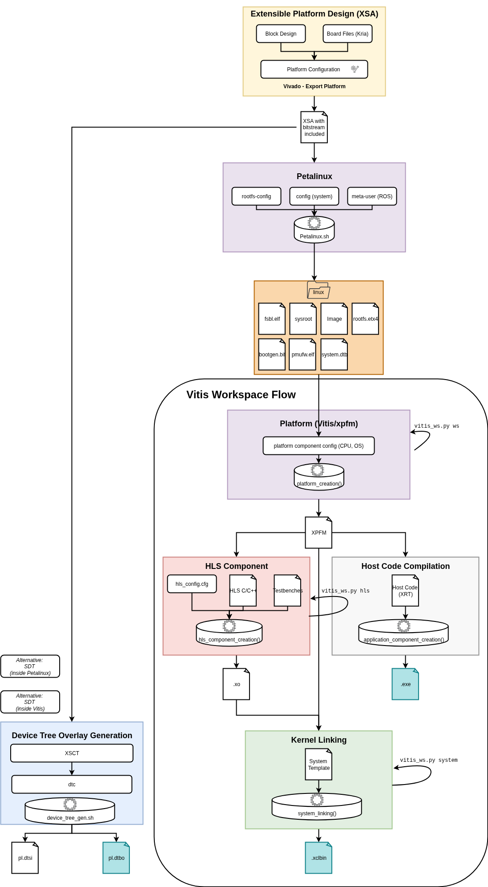

# Vitis Workspace

## Overview

This repository includes Python/Bash scripts for generating High-Level Synthesis (HLS) IPs using Vitis Unified Flow for HLS Kernels. Follow the instructions below to create HLS Kernel objects based on the specified scripts and configurations.

## Prerequisites
* Install Vitis 2024.1
  * select following options for Vitis Flow to work:
    * `Versal ACAP` and `Install devices for Alveo and edge acceleration platforms` are necessary for XRT to work
    * Vitis, Vivado, Vitis HLS are the relevant tools
    * `Kria SOM` and `Zynq UltraScale+ MPSoC` are the devices we use
  * sourcing can be done via
```bash
source <path-to-xilinx>/Vitis/<version>/settings64.sh
```


### Petalinux
* you will need the Linux artifacts from Petalinux
* currently tested:
  * flow based on [Petalinux Firmware Repo](https://git-ads.inf.tu-dresden.de/krs/firmware_kria_petalinux)
  * might also work with `ZYNQMP common image` from [Embedded Platform Download Page](https://www.xilinx.com/support/download/index.html/content/xilinx/en/downloadNav/embedded-platforms.html)


### [Optional] Compile OpenCV in a separate directory for gcc-6
*NOTE: This is only relevant when you want to build the Vitis Vision Library modules*

* follow https://support.xilinx.com/s/article/Vitis-Libraries-Compiling-and-Installing-OpenCV?language=en_US
```bash
cmake -D CMAKE_BUILD_TYPE=RELEASE -D CMAKE_INSTALL_PREFIX=$HOME/.local -D WITH_V4L=ON -D OPENCV_EXTRA_MODULES_PATH=$HOME/Documents/Spielwiese/opencv-4.4.0/source_contrib/modules -DBUILD_TESTS=OFF -DBUILD_ZLIB=ON -DBUILD_JPEG=ON -DWITH_JPEG=ON -DWITH_PNG=ON -DBUILD_EXAMPLES=OFF -DINSTALL_C_EXAMPLES=OFF -DINSTALL_PYTHON_EXAMPLES=OFF -DWITH_OPENEXR=OFF -DBUILD_OPENEXR=OFF -D CMAKE_CXX_COMPILER=$XILINX_HLS/tps/lnx64/gcc-6.2.0/bin/g++ ..
``` 
* will result in installation at `~/.local
```bash
export LD_LIBRARY_PATH=/home/paul/.local/lib:$LD_LIBRARY_PATH
export OPENCV_LIB=/home/paul/.local/lib 
export OPENCV_INCLUDE=/home/paul/.local/include/opencv4
```

* alternative OPENCV functionality is available in default Ubuntu under:
  * use these paths if problems occur in ROS2
```bash
export OPENCV_INCLUDE=usr/include/opencv4
export OPENCV_LIB=/usr/lib/x86_64-linux-gnu
```

## Usage

* general flow depicted below


!Note: you should have already acquired the XSA Extensible Platform, the Linux Filesystem, and the device tree overlay files

### Default Flow

* launch new terminal, only source Vitis 2024 (petalinux will cause error)
* when using OpenCV for CSIM,.. make sure to add following env variables beforehand (adjust accordingly):
```bash
export LD_LIBRARY_PATH=/home/paul/.local/lib:$LD_LIBRARY_PATH
export OPENCV_LIB=/home/paul/.local/lib 
export OPENCV_INCLUDE=/home/paul/.local/include/opencv4
```

* check the configuration under `scripts/config.yaml`
* you can validate your configuration file via `python3 scripts/check_config.py`
* start project creation:
  * run `vitis -s scripts/vitis_ws.py full`
* this will create a single `.xclbin` container containing all specified HLS kernels 
  * the host code is not part of the necessary files for the ROS workspace; but can be used for testing on the utilized Platform OS
  * a final folder under `exports/xxx` contains the files to be uploaded to the board
  * via `--dry` or `-d` a dryrun can be invoked to simply create the workspace but not build anything
  * individual modes `ws`, `clean`, `hls` and `system` allow to interact with the system in more detail, ask for help there


## Testing HW on the Board
* copy files to board `scp -r exports_folder petalinux@192.168.2.2:/home/petalinux`
* ssh onto the board `ssh petalinux@192.168.2.2`
* prepare xmutil environment `sudo cp -r exports_folder /lib/firmware/xilinx/<name>`
  * name will also be what you need to use in following xmutil commands, try to use same name for xclbin,.. to not confuse software
* dynamically load the firmware
  * check for available options: `sudo xmutil listapps`
```
                   Accelerator  Accel_type                          Base    Pid   Base_type  #slots(PL+AIE) Active_slot
              k26-starter-kits    XRT_FLAT              k26-starter-kits  id_ok    XRT_FLAT           (0+0)          0,
                     <name>       XRT_FLAT                     vadd_host  id_ok    XRT_FLAT           (0+0)          -1
```

  * unload `sudo xmutil unloadapp`
    * should return `remove from slot 0 returns: 0 (Ok)`
  * load `<host_code>` via `sudo xmutil loadapp <host_code>`
    * successfull indicated via `<host_code>: loaded to slot 0`
    * error case:

```
[XRT] ERROR: No devices found
Error: Unable to find Target Device
```

* now you simply need to launch your application from inside the exports folder in the home directory on the board `exports/host_code`


### FAQ

#### Frequent Issues
* `cannot execute binary file: Exec format error` indicates that you picked the wrong executable, make sure to select the hardware version
  * verify first that generated host code binary is build for ARM via `file <exe>`:

* Wrong:
```
blur_host_code: ELF 64-bit LSB pie executable, x86-64, version 1 (GNU/Linux), dynamically linked, interpreter /lib64/ld-linux-x86-64.so.2, BuildID[sha1]=09db6bb3531b9abe7e66540218db6c3618f93fb8, for GNU/Linux 3.2.0, with debug_info, not stripped
```
* Correct:
```
blur_host_code: ELF 64-bit LSB pie executable, ARM aarch64, version 1 (GNU/Linux), dynamically linked, interpreter /lib/ld-linux-aarch64.so.1, BuildID[sha1]=5fbdc100c82be349d717657ac7ecf01491f79807, for GNU/Linux 3.14.0, with debug_info, not stripped
```


#### Swap Partition
* sometimes Vitis just consumes unnecessary big amount of RAM, in this case try to increase via swap file
```
cd ~
sudo dd if=/dev/zero of=./.swap bs=1M count=8192
sudo chmod 600 ./.swap
sudo mkswap ./.swap
sudo swapon ./.swap
```